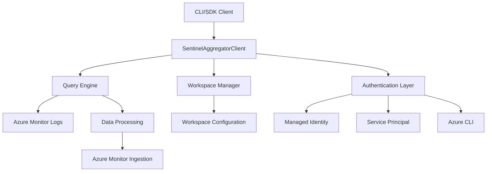

# Microsoft Sentinel Log Aggregator

The Microsoft Sentinel Log Aggregator is an Azure SDK-compliant Python client library designed to collect, process, and aggregate logs from multiple Microsoft Sentinel workspaces into centralized reporting tables for security analytics and dashboard creation.

## Overview

The Sentinel Log Aggregator provides a comprehensive solution for:

- **Multi-workspace aggregation**: Query and aggregate data across multiple Sentinel workspaces
- **Centralized reporting**: Transform and normalize data for unified analytics
- **Scalable processing**: Batch processing with configurable concurrency and time-based batching
- **Azure integration**: Native Azure authentication and monitoring integration
- **Production-ready**: Comprehensive error handling, logging, and health monitoring

## Key features

- **Azure SDK compliance**: Follows Microsoft Azure SDK design guidelines and patterns
- **Flexible authentication**: Supports managed identity, service principal, and Azure CLI authentication
- **Batch processing**: Configurable time-based batching with concurrent execution
- **Error handling**: Service-specific exceptions with detailed error information
- **Health monitoring**: Built-in health checks and service diagnostics
- **Long-running operations**: LRO support for batch operations with progress tracking

## Architecture

The solution is built on a modular architecture with clear separation of concerns:



## Getting started

### Prerequisites

- Python 3.11 or later
- Azure subscription with Microsoft Sentinel workspaces
- Appropriate Azure permissions (Log Analytics Reader, Monitoring Metrics Publisher)

### Installation

Install the package from GitHub:

```bash
# Install from GitHub repository
pip install git+https://github.com/TheAlistairRoss/Sentinel-Log-Aggregator.git

# Or install from GitHub release
pip install https://github.com/TheAlistairRoss/Sentinel-Log-Aggregator/releases/latest/download/sentinel_log_aggregator-0.1.0-py3-none-any.whl
```

### Quick start

```python
import asyncio
from azure.identity.aio import DefaultAzureCredential
from sentinel_log_aggregator import SentinelAggregatorClient, SentinelAggregatorClientOptions

async def main():
    # Create client options from environment
    options = SentinelAggregatorClientOptions.from_environment()
    
    # Create credential and client
    credential = DefaultAzureCredential()
    
    async with SentinelAggregatorClient(
        dcr_logs_ingestion_endpoint=options.dcr_logs_ingestion_endpoint,
        credential=credential,
        options=options
    ) as client:
        
        # Health check
        service_props = await client.get_service_properties()
        print(f"Service status: {service_props.connectivity_status}")

asyncio.run(main())
```

## Next steps

- [Installation and setup](installation.md)
- [Configuration guide](configuration.md)
- [CLI usage](cli-usage.md)
- [SDK usage](sdk-usage.md)
- [Examples](examples/basic-examples.md)

## Additional resources

- [Advanced examples](examples/advanced-examples.md)
- [Best practices](best-practices.md)
- [Troubleshooting](troubleshooting.md)
- [API reference](api-reference.md)
