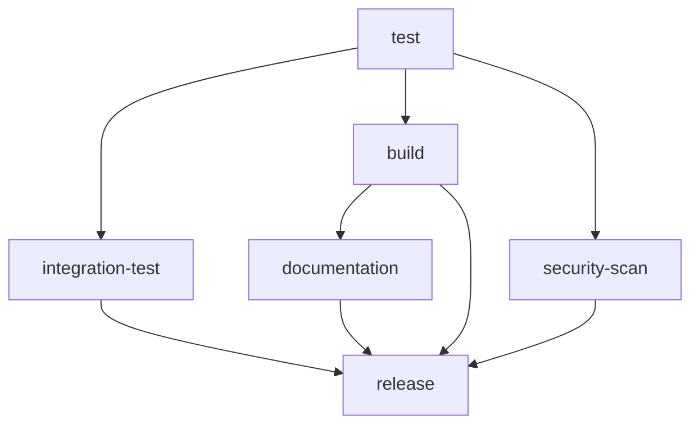

# GitHub Actions Workflows Documentation

This document provides comprehensive documentation for all GitHub Actions workflows in the Sentinel Log Aggregator project, including their purposes, triggers, job dependencies, and troubleshooting guidance.

## Overview

The project uses two main workflows to ensure code quality, security, and automated deployment:

1. **CI/CD Pipeline** (`.github/workflows/ci-cd.yml`) - Complete development lifecycle automation
2. **Security Scanning** (`.github/workflows/security.yml`) - Microsoft SDL-compliant security analysis

## CI/CD Pipeline Workflow

### Purpose
Automates the complete development lifecycle including testing, security scanning, documentation generation, package building, and automated releases.

### Triggers
- **Push Events**: `main` and `develop` branches
- **Pull Requests**: Targeting `main` branch
- **Release Tags**: Tags matching `v*` pattern (e.g., `v1.0.0`)
- **Manual Dispatch**: Can be triggered manually via GitHub UI

### Environment Variables
```yaml
PYTHON_DEFAULT: "3.11"  # Default Python version for most jobs
```

### Jobs Overview

#### 1. Test Job (`test`)
**Purpose**: Comprehensive testing across multiple Python versions with integrated security scanning

**Strategy**: Matrix testing across Python 3.8, 3.9, 3.10, and 3.11

**Key Steps**:
- Environment setup and dependency installation
- Unit tests with pytest and coverage reporting
- Integration with Azure services (using mock credentials)
- Security scanning with Bandit, Safety, and pip-audit
- MyPy type checking for code quality
- Coverage reporting and badge generation

**Artifacts**:
- `test-reports-{python-version}`: Test results and coverage reports
- `security-scan-results`: Security scan outputs

**Dependencies**: None (runs first)

#### 2. Integration Test Job (`integration-test`)
**Purpose**: End-to-end testing with real Azure services (when credentials available)

**Key Steps**:
- Azure credential validation
- Real Azure Monitor API testing
- Workspace connectivity verification
- Integration with Data Collection Rules (DCR)

**Conditions**: 
- Only runs on `main` branch pushes
- Requires Azure credentials to be available

**Dependencies**: Runs after `test` job completion

#### 3. Build Job (`build`)
**Purpose**: Package creation and validation for distribution

**Key Steps**:
- Python package building (wheel and source distributions)
- Package validation with twine
- CHANGELOG.md validation
- Version consistency checking

**Artifacts**:
- `packages`: Built wheel and source distributions ready for release

**Dependencies**: Runs after `test` job completion

#### 4. Security Scan Job (`security-scan`)
**Purpose**: Infrastructure and container security scanning with Trivy

**Key Steps**:
- Trivy filesystem vulnerability scanning
- Configuration security assessment
- SARIF report generation for GitHub Security tab

**Artifacts**:
- `trivy-results`: Detailed vulnerability reports

**Dependencies**: Runs after `test` job completion

#### 5. Documentation Job (`documentation`)
**Purpose**: Automated documentation building and GitHub Pages deployment

**Key Steps**:
- Sphinx documentation generation
- API documentation from docstrings
- GitHub Pages deployment (on main branch)
- Documentation artifact creation

**Artifacts**:
- `documentation`: Built documentation HTML files

**Conditions**: 
- Full deployment only on `main` branch
- Artifact generation on all branches

**Dependencies**: Runs after `build` job completion

#### 6. Release Job (`release`)
**Purpose**: Automated package publishing and GitHub release creation

**Key Steps**:
- GitHub release creation with changelog
- PyPI package publishing
- Release artifact attachment
- Notification and tagging

**Conditions**: 
- Only runs on version tag pushes (`v*`)
- Requires all previous jobs to succeed

**Dependencies**: Requires successful completion of all other jobs

### Workflow Dependencies



## Security Scanning Workflow

### Purpose
Implements Microsoft Secure Development Lifecycle (SDL) requirements through comprehensive automated security analysis.

### Triggers
- **Push Events**: `main` and `develop` branches
- **Pull Requests**: Targeting `main` branch  
- **Scheduled**: Weekly scans every Monday at 2 AM UTC
- **Manual Dispatch**: Can be triggered manually

### Environment Variables
```yaml
PYTHON_VERSION: "3.11"  # Python version for security scanning
```

### Jobs Overview

#### 1. Comprehensive Security Scan (`security-comprehensive`)
**Purpose**: Multi-tool security analysis covering SAST, SCA, secrets detection, and compliance

**Permissions**:
- `contents: read` - Repository access
- `security-events: write` - Security tab uploads
- `actions: read` - Workflow access

**Security Tools Integrated**:

##### Static Application Security Testing (SAST)
- **Bandit**: Python-specific security issue detection
  - Outputs: JSON reports and console summary
  - Severity: Medium and above
  
- **Semgrep**: Multi-language security pattern matching
  - Rulesets: security-audit, secrets, python
  - Output: SARIF format for GitHub integration

##### Software Composition Analysis (SCA)
- **Safety**: Python package vulnerability database scanning
  - Database: PyUp.io vulnerability database
  - Output: JSON reports with vulnerability details
  
- **pip-audit**: Official Python Package Index security scanning
  - Authority: PyPI security advisory database
  - Output: Detailed vulnerability descriptions

##### Secrets Detection
- **TruffleHog**: Advanced secrets and credential scanning
  - Scope: Full repository history
  - Verification: Only verified secrets reported
  - Mode: Debug enabled for detailed analysis

##### Infrastructure Security
- **Trivy**: Multi-purpose security scanner
  - Filesystem scanning: Dependencies and code vulnerabilities
  - Configuration scanning: Infrastructure as Code security
  - Output: SARIF format with CRITICAL/HIGH/MEDIUM severities

##### Compliance and Governance
- **SBOM Generation**: Software Bill of Materials creation
  - Formats: SPDX-JSON and CycloneDX-JSON
  - Tool: Syft from Anchore
  
- **License Compliance**: License analysis and validation
  - Tool: pip-licenses
  - Output: License inventory and compliance report

**Artifacts**:
- `security-reports`: All scan results and reports
- SARIF uploads to GitHub Security tab
- Security summary in workflow output

#### 2. CodeQL Analysis (`codeql`)
**Purpose**: GitHub's semantic code analysis for security vulnerabilities

**Configuration**:
- Language: Python
- Query Suites: security-extended, security-and-quality
- Analysis: Comprehensive semantic analysis

**Integration**: Results automatically appear in GitHub Security tab

#### 3. Dependency Review (`dependency-review`)
**Purpose**: Pull request dependency change analysis

**Conditions**: Only runs on pull request events

**Configuration**:
- Fail threshold: Moderate severity vulnerabilities
- Allowed licenses: MIT, Apache-2.0, BSD-2-Clause, BSD-3-Clause, ISC

**Purpose**: Prevents introduction of vulnerable dependencies

## Security Integration

### Microsoft SDL Compliance
The security workflows implement Microsoft Secure Development Lifecycle requirements:

1. **Threat Modeling**: Covered through comprehensive SAST analysis
2. **Security Testing**: Automated through multiple security tools
3. **Secure Coding**: Enforced through pre-commit hooks and CI/CD integration
4. **Security Response**: Automated vulnerability detection and reporting

### Security Reporting
- **GitHub Security Tab**: Centralized vulnerability management
- **SARIF Integration**: Industry-standard security reporting format
- **Automated Alerts**: GitHub notifications for new vulnerabilities
- **Weekly Scans**: Proactive security monitoring

## Troubleshooting Guide

### Common Issues and Solutions

#### CI/CD Pipeline Issues

**Issue**: Test failures on specific Python versions
```
Solution: Check matrix strategy compatibility
- Review dependency versions for Python compatibility
- Check test fixtures for version-specific behavior
- Verify Azure SDK compatibility with Python version
```

**Issue**: Package build failures
```
Solution: Validate package configuration
- Check pyproject.toml syntax and dependencies
- Verify MANIFEST.in includes all necessary files
- Ensure version.py contains valid version string
```

**Issue**: Documentation build failures
```
Solution: Check Sphinx configuration
- Verify all docstring formats are valid
- Check for missing documentation dependencies
- Ensure API documentation generation succeeds
```

**Issue**: Release job failures
```
Solution: Verify release prerequisites
- Ensure version tag follows semantic versioning (v1.2.3)
- Check PyPI credentials are configured correctly
- Verify CHANGELOG.md format is valid
```

#### Security Workflow Issues

**Issue**: High number of false positives
```
Solution: Configure security tool exclusions
- Add .bandit configuration for false positives
- Configure Semgrep rules for project-specific exclusions
- Review and whitelist known-safe dependencies
```

**Issue**: Secrets detection failures
```
Solution: Verify secrets management
- Use GitHub secrets for sensitive data
- Add .gitignore entries for local secrets
- Configure TruffleHog exclusions for test fixtures
```

**Issue**: License compliance failures
```
Solution: Review dependency licenses
- Check new dependencies against allowed license list
- Update license allowlist if needed
- Consider alternative packages with compatible licenses
```

### Performance Optimization

#### Reducing Workflow Runtime
1. **Caching Strategies**: Python dependencies cached between runs
2. **Parallel Execution**: Independent jobs run concurrently
3. **Conditional Execution**: Resource-intensive jobs only on necessary branches

#### Resource Management
1. **Matrix Strategy**: Balanced across Python versions
2. **Artifact Cleanup**: Automatic cleanup of old artifacts
3. **Runner Selection**: Appropriate runner sizes for job requirements

## Best Practices

### Workflow Maintenance
1. **Regular Updates**: Keep actions to latest versions
2. **Security Monitoring**: Review security scan results weekly
3. **Performance Review**: Monitor workflow execution times
4. **Dependency Management**: Keep security tools up to date

### Security Best Practices
1. **Secret Management**: Never commit secrets to repository
2. **Principle of Least Privilege**: Minimal required permissions
3. **Regular Scanning**: Automated and manual security reviews
4. **Incident Response**: Defined process for security findings

### Development Integration
1. **Pre-commit Hooks**: Local security scanning before commits
2. **Branch Protection**: Require workflow success for merging
3. **Code Review**: Security-focused review process
4. **Documentation**: Keep workflow documentation current

## Monitoring and Metrics

### Key Performance Indicators
- **Test Coverage**: Target >95% code coverage
- **Security Score**: Zero high/critical vulnerabilities
- **Build Success Rate**: >98% successful builds
- **Documentation Coverage**: Complete API documentation

### Workflow Metrics
- **Average Runtime**: Monitor for performance regression
- **Success Rates**: Track workflow reliability
- **Security Findings**: Trend analysis of vulnerabilities
- **Dependency Health**: Monitor dependency update cadence

## Contact and Support

For workflow issues or questions:
1. **GitHub Issues**: Create issue with `workflow` label
2. **Security Concerns**: Use security advisory process
3. **Documentation Updates**: Submit pull request to docs/workflows.md

---

*This documentation is maintained as part of the project's commitment to transparency and developer experience. Last updated: Generated automatically from workflow analysis.*